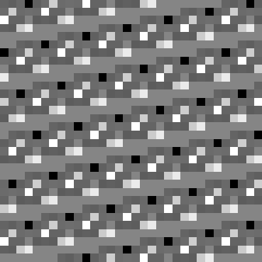
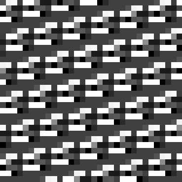
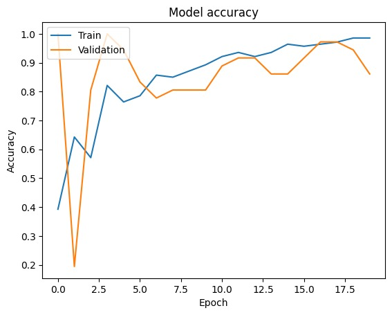
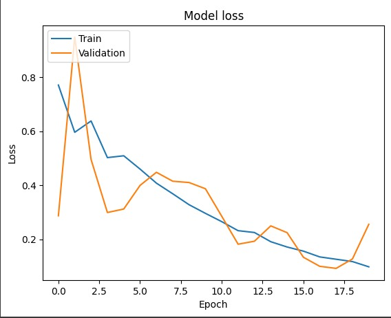

# Few-Shot Learning for Anomaly Detection in Kubernetes Network Flows

Welcome to the repository containing a few-shot learning approach for anomaly detection within Kubernetes network flows. By leveraging the transformation of network flow data into 32x32 image formats, this project utilizes both convolutional neural networks (CNNs) and Siamese networks to achieve effective anomaly detection.

## Project Overview

The goal of this project is to detect anomalies in network flow data by transforming the data into image format and applying advanced machine learning techniques. This project uses network flow data provided by the repository at [Yiğit Sever's Kubernetes Dataset](https://github.com/yigitsever/kubernetes-dataset). By converting network flow data into images, we leverage the powerful feature extraction capabilities of CNNs, combined with the robust classification abilities of few-shot learning models and Siamese networks.

### Visual Examples of Data Conversion

The following images are examples of the data after conversion, showing how network flow data is transformed into visual formats that are then used for machine learning analysis.

| Benign Data Example | Malicious Data Example |
|:-------------------:|:----------------------:|
|  |  |

## 🌟 Key Features

- **Data Conversion**: Preprocessing and conversion of network flow data into 32x32 grayscale images, enhancing the visibility of patterns indicative of normal or anomalous traffic.
- **Few-Shot Learning**: A strategic approach that trains models on limited samples to maximize effectiveness in real-world scenarios where labeled data is scarce.
- **Siamese Network Architecture**: Utilizes a Siamese network to compare pairs of images, significantly improving the model's ability to distinguish between normal and anomalous states effectively.

## 📊 Results

The application of few-shot learning alongside image-based data representation has led to promising outcomes in detecting and classifying anomalous behavior within network flows efficiently.

### Model Performance Visualizations

#### Model Accuracy Over Epochs


#### Model Loss Over Epochs


These graphs illustrate the model's performance, highlighting the improvements in accuracy and reduction in loss over time, validating the effectiveness of our methodology.

## 🛠 Getting Started

Follow these steps to set up the project locally and replicate the results:

### Prerequisites

- Python 3.8+
- pip
- virtualenv (recommended)

### Installation

1. Clone the repo
   ```sh
   git clone https://github.com/atakanozt/anomaly-detection-kubernetes
   ```
2. Navigate to the project directory
   ```sh
   cd anomaly-detection-kubernetes
   ```
3. Create a virtual environment
   ```sh
   python -m venv venv
   ```
4. Activate the virtual environment
   ```sh
   source venv/bin/activate
   ```
5. Install required packages
   ```sh
   pip install -r requirements.txt
   ```
   


### Usage

1. First, you need to adjust main.py for image conversion and for related adjustments and then:
   ```sh
   python run_model.py
   ```
2. After images are saved in some directory. Also adjust siamese_network.py for image path and then:
   ```sh
   python siamese_network.py
   ```


## Contributing

Contributions are what make the open-source community such an amazing place to learn, inspire, and create. Any contributions you make are **greatly appreciated**.

## Acknowledgements

- **Dataset**: The network flow data used in this project was sourced from [Yiğit Sever's Kubernetes Dataset](https://github.com/yigitsever/kubernetes-dataset), which provides a comprehensive set of Kubernetes network flow data ideal for anomaly detection research.

## Contact

Atakan Öztarak - [@linkedIn](https://www.linkedin.com/in/atakan-%C3%B6ztarak/) - atakanoztara21@gmail.com

Project Link: [https://github.com/atakanozt/anomaly-detection-kubernetes](https://github.com/atakanozt/anomaly-detection-kubernetes)